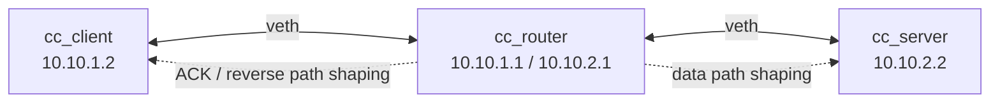

# Netem TCP Congestion-Control Benchmark

`netem_bench.sh` is a Linux network-emulation benchmark for comparing TCP congestion-control algorithms under controlled WAN-like conditions. It builds an isolated three-namespace topology, shapes the bottleneck with HTB, injects impairments with `tc netem`, optionally applies `tc police` ingress policing, drives traffic with `iperf3`, and exports both raw and summarized results.

The benchmark is designed for questions like:

- How do `cubic`, `bbr`, `reno`, or other available TCP congestion controls behave under delay, loss, jitter, reordering, ACK-path pressure, capacity drops, and policing?
- How fair are algorithms when competing with themselves or with other algorithms?
- Which algorithms build large queues under a deep FIFO bottleneck?
- How do short flows behave alone and while a long flow is active?
- What happens when several impairments occur in one long-lived flow?

> The impairment is placed in a router namespace rather than directly on the TCP sender, so the sender's local qdisc is not the mechanism creating the emulated WAN delay/loss.

---

## Contents

- [Overview](#overview)
- [Requirements](#requirements)
- [Quick start](#quick-start)
- [How the benchmark works](#how-the-benchmark-works)
- [Scenarios](#scenarios)
- [Test groups](#test-groups)
- [Configuration](#configuration)
- [Output layout](#output-layout)
- [Reading the results](#reading-the-results)
- [Recommended workflows](#recommended-workflows)
- [Methodology notes and caveats](#methodology-notes-and-caveats)
- [Troubleshooting](#troubleshooting)
- [Contributing](#contributing)
- [License](#license)

---

## Overview

The script creates this topology:



Default path model:

- Client namespace sends traffic to server namespace through a router namespace.
- Router data egress applies HTB rate shaping and `netem` delay/loss/jitter/reordering.
- Router client-side egress models the reverse path, usually the ACK path for uploads.
- Optional ingress policing on the router client-side interface drops packets above a configured token-bucket rate.
- `iperf3` runs inside the namespaces and emits JSON.
- The script records per-flow summaries, per-second intervals, dynamic event timelines, ping RTT probes, queue samples, `ss` socket samples, and `tc` qdisc/class/filter state.

The default algorithm list is:

```bash
ALGOS="cubic bbr reno"
```

Unavailable congestion-control algorithms are skipped automatically based on `/proc/sys/net/ipv4/tcp_available_congestion_control`.

---

## Requirements

Target system: Debian 13 or a similar Linux distribution with network namespaces and modern `tc` support.

Install the required tools:

```bash
sudo apt update
sudo apt install -y iproute2 iperf3 python3 kmod iputils-ping
```

Required commands:

- `ip`
- `tc`
- `iperf3`
- `python3`
- `ss`
- `modprobe`
- `ping`

The script must run as root because it creates network namespaces, veth interfaces, qdiscs, filters, and kernel modules:

```bash
sudo bash ./netem_bench.sh
```

Optional qdiscs/modules used when available:

- `sch_netem`
- `sch_htb`
- `sch_ingress`
- `cls_u32`
- `act_police`
- `sch_fq`
- `sch_fq_codel`
- `sch_cake`
- `sch_tbf`

---

## Quick start

Run the default benchmark:

```bash
sudo bash ./netem_bench.sh
```

Run a small smoke test:

```bash
sudo ALGOS="cubic bbr" TEST_GROUPS=core REPEATS=1 bash ./netem_bench.sh
```

Run a latency sweep:

```bash
sudo ALGOS="cubic bbr reno" \
  SCENARIOS="latency_sweep" \
  LATENCY_SWEEP="1ms 50ms 100ms 200ms 300ms" \
  bash ./netem_bench.sh
```

Run competition and fairness scenarios:

```bash
sudo ALGOS="cubic bbr reno" \
  COMPETITOR_ALGOS=auto \
  SCENARIOS="flow_join flow_fairness" \
  bash ./netem_bench.sh
```

Run bufferbloat-only tests:

```bash
sudo TEST_GROUPS=bufferbloat \
  ALGOS="cubic bbr reno" \
  BUFFERBLOAT_QUEUE_PROFILE=pfifo_deep \
  bash ./netem_bench.sh
```

Run with custom path settings:

```bash
sudo BASE_RATE=200mbit \
  DROP_RATE=25mbit \
  POLICE_RATE=40mbit \
  ONEWAY_DELAY=25ms \
  bash ./netem_bench.sh
```

Use lightweight parallel orchestration for static, low-noise scenarios:

```bash
sudo PARALLEL_WORKERS=4 bash ./netem_bench.sh
```

Disable lightweight parallel orchestration:

```bash
sudo LIGHTWEIGHT_PARALLEL=0 bash ./netem_bench.sh
```

---

## How the benchmark works

### Namespace topology

By default, the script creates:

| Namespace | Role | Default IP |
|---|---|---:|
| `cc_client` | TCP client / iperf3 client | `10.10.1.2` |
| `cc_router` | Router and impairment point | `10.10.1.1`, `10.10.2.1` |
| `cc_server` | iperf3 server | `10.10.2.2` |

Default interfaces:

| Interface | Namespace | Purpose |
|---|---|---|
| `c0` | `cc_client` | Client-side veth |
| `rc0` | `cc_router` | Router interface toward client |
| `rs0` | `cc_router` | Router interface toward server |
| `s0` | `cc_server` | Server-side veth |

### Data path and reverse path

For upload tests, the data path is:

```text
cc_client -> cc_router -> cc_server
```

The data bottleneck is usually configured on the router interface toward the server. The ACK/reverse path is configured separately on the router interface toward the client.

This separation allows scenarios such as:

- forward data loss with clean ACKs;
- reverse/ACK loss with clean data;
- ACK rate limiting;
- ACK delay spikes;
- reverse-path bufferbloat;
- download-mode tests where the reverse direction becomes the data bottleneck.

### Traffic generation

The benchmark uses `iperf3` with JSON output and one-second interval reporting. For each flow, it records:

- congestion-control algorithm;
- scenario and variant;
- role, such as `primary`, `competitor`, `filler`, `short_*`, or `probe`;
- direction, such as upload, download, or bidirectional;
- configured rate, latency, loss, policer, queue profile, and repeat index;
- throughput, retransmissions, bytes sent/received, utilization, success/failure, and raw file paths.

### Dynamic events

Dynamic scenarios schedule qdisc or policer changes while a flow is active. Examples include:

- latency spike and recovery;
- capacity drop and recovery;
- sudden loss and recovery;
- burst loss windows;
- policer enable/disable;
- adaptive policer feedback loops;
- combined long-run impairment sequences.

All dynamic changes are written to `data/events.csv` and `raw/events/*.csv`.

---

## Scenarios

The default `SCENARIOS` list includes most scenarios except `latency_sweep` and `combined_all`. You can enable any supported scenario explicitly with `SCENARIOS="..."`, or choose a coarse group with `TEST_GROUPS`.

### Baseline and latency

| Scenario | Purpose |
|---|---|
| `baseline` | Clean single-flow reference at the configured bottleneck rate and latency. |
| `latency_sweep` | Clean single-flow tests over `LATENCY_SWEEP`; supported but not enabled by default. |
| `latency_spike` | Starts clean, temporarily increases one-way delay to `HIGH_DELAY`, then restores baseline delay. |
| `latency_reduction` | Starts at `HIGH_DELAY`, temporarily reduces latency, then returns to high delay. |
| `capacity_drop` | Starts at `BASE_RATE`, drops to `DROP_RATE`, then restores `BASE_RATE`. |

### Loss, jitter, and reordering

| Scenario | Purpose |
|---|---|
| `sustain_loss` | Applies sustained independent random loss on forward and reverse paths. |
| `loss_bursts` | Schedules explicit burst-loss windows with clean periods between them. |
| `loss_spike` | Temporarily applies severe random loss and then recovers. |
| `jitter_light` | Adds low normal jitter. |
| `jitter_heavy` | Adds heavier normal jitter. |
| `jitter_long_tail` | Adds large long-tail pareto-normal jitter. |
| `reorder_light` | Adds mild packet reordering. |
| `reorder_heavy` | Adds heavier packet reordering. |

### Policing

| Scenario | Purpose |
|---|---|
| `policer_static` | Enables an ingress `tc police` dropper for the whole run. |
| `policer_spike` | Enables and then disables the ingress policer mid-flow. |
| `policer_adaptive_rate` | Enables/disables policing based on measured data-path Mbps thresholds. |
| `policer_adaptive_retrans` | Enables/disables policing based on retransmission-rate thresholds. |

`netem` loss and policer loss are intentionally different. `netem` loss is probabilistic packet impairment; policer loss is token-bucket overflow loss from packets exceeding a configured rate/burst.

### ACK-path impairments

| Scenario | Purpose |
|---|---|
| `ack_rate_limit` | Rate-limits the reverse/ACK path. |
| `ack_loss` | Applies loss on the reverse/ACK path. |
| `ack_delay_spike` | Temporarily increases ACK-path delay. |
| `ack_bufferbloat` | Uses a constrained, deep-queue ACK path. |

### Competition and fairness

| Scenario | Purpose |
|---|---|
| `flow_join` | Starts a primary flow, then starts a competitor after `COMPETITOR_START`. |
| `flow_fairness` | Starts primary and competitor flows simultaneously and computes Jain fairness. |
| `flow_fairness_sustain_loss` | Simultaneous competition with sustained forward/reverse loss. |
| `flow_fairness_loss_spike` | Simultaneous competition with a dynamic loss spike. |
| `flow_fairness_latency_spike` | Simultaneous competition with a dynamic latency spike. |
| `flow_fairness_capacity_drop` | Simultaneous competition with a dynamic capacity drop. |
| `flow_fairness_policer` | Simultaneous competition with dynamic ingress policing. |
| `flow_fairness_ack_limit` | Simultaneous competition with ACK-path rate limiting. |
| `flow_fairness_jitter` | Simultaneous competition with long-tail jitter. |
| `flow_fairness_reorder` | Simultaneous competition with packet reordering. |
| `flow_churn` | Starts a long primary flow and repeatedly starts short-lived competitor flows. |

When `COMPETITOR_ALGOS=auto`, each primary algorithm is tested against each selected algorithm, including same-algorithm competition.

### Short flows

| Scenario | Purpose |
|---|---|
| `short_flow_repeated` | Runs repeated serialized byte-limited transfers. |
| `short_flow_under_load` | Runs short byte-limited transfers while a long filler flow is active. |

### Bufferbloat

| Scenario | Purpose |
|---|---|
| `bufferbloat_upload` | Measures idle, loaded, and recovery RTT during upload load. |
| `bufferbloat_download` | Measures idle, loaded, and recovery RTT during download load. |
| `bufferbloat_bidirectional` | Measures queueing during simultaneous upload and download load. |

Bufferbloat scenarios default to `BUFFERBLOAT_QUEUE_PROFILE=pfifo_deep`, an unmanaged deep FIFO-like bottleneck. Use `BUFFERBLOAT_QUEUE_PROFILE=fq`, `fq_codel`, or `cake` only when intentionally comparing managed queue/AQM behavior.

### Profiles and combined stress

| Scenario | Purpose |
|---|---|
| `profile_seedbox_torrent_upload` | Seedbox-like high-rate upload competition profile. |
| `profile_proxy_mobile_china` | Synthetic proxy-to-mobile download profile with mobile-like phases. |
| `combined_all` | Long sequenced torture test combining latency, jitter, ACK pressure, bufferbloat, loss, capacity drop, policing, competition, and recovery. Supported but not enabled by default. |

The profile scenarios are synthetic profiles. Treat them as parameterized stress models unless you calibrate the knobs against real measurements.

---

## Test groups

Use `TEST_GROUPS` when you want a named bundle without listing every scenario.

Examples:

```bash
sudo TEST_GROUPS=core bash ./netem_bench.sh
sudo TEST_GROUPS="latency loss policing" bash ./netem_bench.sh
sudo TEST_GROUPS=all bash ./netem_bench.sh
```

Supported groups:

| Group | Expands to |
|---|---|
| `standard` | Baseline, dynamic latency/rate/loss, policing, ACK path, competition, short-flow-under-load, bufferbloat, and profiles. |
| `core` | `baseline latency_spike latency_reduction capacity_drop` |
| `latency` | Baseline, latency spikes/reductions, jitter, and reordering. |
| `loss` | Sustained loss, burst loss, loss spike, jitter, and reordering. |
| `policing` | Static, spike, and adaptive policer scenarios. |
| `competition` | Flow join, fairness, impairment fairness variants, and churn. |
| `flow_fairness` | All `flow_fairness*` scenarios. |
| `bufferbloat` | Upload, download, and bidirectional bufferbloat. |
| `ack_path` | ACK rate limit, ACK loss, ACK delay spike, and ACK bufferbloat. |
| `short_flow` | Repeated short flows and short flows under load. |
| `real_world_profiles` | Seedbox upload and proxy/mobile profile scenarios. |
| `combined` | `combined_all` |
| `all` | Every supported scenario, including `combined_all`. |

If both `SCENARIOS` and `TEST_GROUPS` are set, `SCENARIOS` wins.

---

## Configuration

All major settings are environment variables. Set them before `bash ./netem_bench.sh`.

### Core selection

| Variable | Default | Meaning |
|---|---:|---|
| `ALGOS` | `cubic bbr reno` | Primary congestion-control algorithms. |
| `COMPETITOR_ALGOS` | `auto` | Competitor algorithms; `auto` means all selected primary algorithms. |
| `SCENARIOS` | long default list | Explicit scenario list. |
| `TEST_GROUPS` | empty | Coarse scenario groups; ignored when `SCENARIOS` is set. |
| `REPEATS` | `1` | Number of repeats per case. Increase for real comparisons. |
| `RESULT_ROOT` | `./netem-results` | Root output directory. |
| `RUN_ID` | timestamp | Run identifier and output subdirectory name. |
| `OUT_DIR` | `${RESULT_ROOT}/${RUN_ID}` | Full output directory. |

### Rate and latency

| Variable | Default | Meaning |
|---|---:|---|
| `BASE_RATE` | `100mbit` | Main data-path bottleneck rate. |
| `DROP_RATE` | `20mbit` | Capacity-drop rate. |
| `ACK_RATE` | `1000mbit` | Default reverse/ACK-path rate. |
| `RATE_MODE` | `single` | `single`, `sweep`, or `scenario`. |
| `RATE_SWEEP` | `100mbit 1gbit` | Rate list when `RATE_MODE=sweep`. |
| `ENABLE_10G_STRESS` | `0` | Add selected 10G stress runs. |
| `TEN_G_RATE` | `10gbit` | 10G stress rate. |
| `ONEWAY_DELAY` | `20ms` | Default one-way delay; approximate RTT is twice this. |
| `HIGH_DELAY` | `200ms` | High-latency phase. |
| `LOW_DELAY` | `1ms` | Low-latency recovery/reduction phase. |
| `LATENCY_MODE` | `smart` | `smart`, `full`, or `single`. |
| `LATENCY_SWEEP` | `1ms 15ms 50ms 150ms` | Latency sweep values. |

`LATENCY_MODE=smart` uses scenario-specific latency sets to reduce runtime while still sweeping latency-sensitive scenarios.

### Loss and burst loss

| Variable | Default | Meaning |
|---|---:|---|
| `SUSTAINED_LOSS` | `0.5%` | Legacy default sustained loss knob. |
| `SUSTAINED_LOSS_FWD` | from `SUSTAINED_LOSS` | Sustained forward data-path loss. |
| `SUSTAINED_LOSS_REV` | from `SUSTAINED_LOSS` | Sustained reverse/ACK-path loss. |
| `LOSS_FWD` / `LOSS_REV` | unset | Compatibility aliases for forward/reverse sustained loss. |
| `SUDDEN_LOSS` | `15%` | Loss used in spike scenarios. |
| `BURST_LOSS_RATE` | `25%` | Loss rate during burst windows. |
| `BURST_ON_SECONDS` | `2` | Burst-loss duration. |
| `BURST_OFF_SECONDS` | `5` | Clean period between bursts. |
| `BURST_COUNT` | `3` | Number of burst windows. |
| `BURST_START` | `${EVENT_AT}` | Delay before first burst. |

### Policer

| Variable | Default | Meaning |
|---|---:|---|
| `POLICE_RATE` | `30mbit` | Ingress policer token-bucket rate. |
| `POLICE_BURST` | `64kb` | Policer burst. |
| `POLICE_MTU` | `64kb` | Policer MTU, large enough for veth/GSO paths. |
| `POLICE_MATCH_DST` | `${S_IP}/32` | Match client-to-server traffic by default. |

### Queues and AQM

| Variable | Default | Meaning |
|---|---:|---|
| `QUEUE_PROFILE` | `netem_fifo` | Default queue profile. |
| `BUFFERBLOAT_QUEUE_PROFILE` | `pfifo_deep` | Controlled queue profile for bufferbloat scenarios. |
| `QUEUE_MODE` | `auto` | Auto-size netem queue from BDP, or use static limit. |
| `QUEUE_PACKETS` | `10000` | Static/default queue packet limit. |
| `BUFFERBLOAT_DEEP_PACKETS` | `200000` | Deep FIFO packet limit for bufferbloat. |
| `FQ_LIMIT`, `FQ_FLOW_LIMIT`, `FQ_QUANTUM` | varies | `fq` tuning. |
| `FQ_CODEL_LIMIT`, `FQ_CODEL_TARGET`, `FQ_CODEL_INTERVAL`, `FQ_CODEL_ECN` | varies | `fq_codel` tuning. |
| `CAKE_OVERHEAD_MODE`, `CAKE_ECN_MODE` | varies | `cake` tuning. |

Supported queue profiles include:

- `netem_fifo`
- `pfifo_deep`
- `pfifo_bdp`
- `fq`
- `fq_codel`
- `cake`

### ACK path

| Variable | Default | Meaning |
|---|---:|---|
| `ACK_LIMIT_RATE` | `5mbit` | ACK-path rate limit. |
| `ACK_LOSS_RATE` | `1%` | ACK-path loss rate. |
| `ACK_SPIKE_DELAY` | `${HIGH_DELAY}` | ACK delay spike. |
| `ACK_BUFFERBLOAT_RATE` | `10mbit` | ACK-bufferbloat reverse-path rate. |
| `ACK_BUFFERBLOAT_QUEUE_PROFILE` | `pfifo_deep` | ACK-bufferbloat queue profile. |

### Flow competition and short flows

| Variable | Default | Meaning |
|---|---:|---|
| `COMPETITOR_START` | `10` | Seconds before a competitor joins. |
| `COMPETITOR_DURATION` | `20` | Competitor duration. |
| `FLOW_JOIN_POST` | `5` | Extra primary-flow time after competitor ends. |
| `MULTI_COMPETITOR_FLOWS` | `3` | Competitor count; total fairness flows are `1 + MULTI_COMPETITOR_FLOWS`. |
| `SHORT_FLOW_COUNT` | `20` | Number of short flows. |
| `SHORT_FLOW_BYTES` | `1M` | Byte target per short flow. |
| `SHORT_FLOW_GAP` | `0.2` | Gap between short flows. |
| `CHURN_DURATION` | `60` | Primary duration for churn. |
| `CHURN_COMPETITOR_COUNT` | `6` | Number of churn competitors. |
| `CHURN_INTERVAL` | `6` | Seconds between churn competitors. |
| `CHURN_FLOW_DURATION` | `12` | Churn competitor duration. |

### Bufferbloat probes

| Variable | Default | Meaning |
|---|---:|---|
| `PING_INTERVAL` | `0.2` | Ping interval during RTT probes. |
| `PING_SIZE` | `56` | Ping payload size. |
| `BB_IDLE_SECONDS` | `8` | Idle RTT probe duration. |
| `BB_LOAD_DURATION` | `30` | Loaded phase duration. |
| `BB_RECOVERY_SECONDS` | `8` | Recovery RTT probe duration. |
| `BB_SAMPLE_QUEUE_STATS` | `1` | Capture direct qdisc backlog samples. |
| `BB_QUEUE_SAMPLE_INTERVAL` | `0.5` | Queue sample interval. |
| `BB_SAMPLE_VALID_MIN_RATIO` | `0.80` | Minimum expected ping sample ratio for validity. |

### Runtime and parallelism

| Variable | Default | Meaning |
|---|---:|---|
| `BASE_DURATION` | `30` | Clean/base single-flow duration. |
| `EVENT_DURATION` | `40` | Dynamic scenario duration. |
| `ADAPTIVE_DURATION` | `1` | Extend duration for high-BDP/high-latency cases. |
| `OMIT` | `3` | iperf3 omit/warmup seconds. |
| `SS_INTERVAL` | `1` | `ss` sample interval. |
| `RUN_COOLDOWN` | `2` | Cooldown between top-level runs. |
| `COMPETITION_COOLDOWN` | `${RUN_COOLDOWN}` | Cooldown between competition matrix cases. |
| `LIGHTWEIGHT_PARALLEL` | `1` | Enable parent orchestration for static scenarios. |
| `PARALLEL_WORKERS` | `2` | Number of lightweight workers; `auto` caps conservatively. |
| `PARALLEL_LIGHTWEIGHT_SCENARIOS` | static scenario list | Scenarios eligible for parallel child topologies. |

Dynamic, competition, bufferbloat, and profile tests are kept sequential by default because they intentionally observe time interactions and can be sensitive to host CPU pressure.

---

## Output layout

Each run writes to:

```text
./netem-results/<timestamp>/
```

Typical output tree:

```text
netem-results/<run_id>/
├── report.md
├── manifest.json
├── run-meta.txt
├── data/
│   ├── runs.csv
│   ├── intervals.csv
│   ├── events.csv
│   ├── rtt_samples.csv
│   ├── queue_samples.csv
│   ├── metrics.csv
│   ├── failures.csv
│   ├── scenario-algo-summary.csv
│   ├── flow-fairness.csv
│   ├── flow-join-overlap.csv
│   ├── bufferbloat-summary.csv
│   ├── bufferbloat-algo-summary.csv
│   └── bufferbloat-queue-summary.csv
└── raw/
    ├── iperf-json/
    ├── tcp-ss/
    ├── tc/
    ├── events/
    ├── ping/
    ├── queue/
    ├── stderr/
    └── server-logs/
```

### Main data files

| File | Description |
|---|---|
| `data/runs.csv` | One row per iperf3 flow/run. This is the main per-flow table. |
| `data/intervals.csv` | One row per iperf3 interval, useful for event-aligned analysis. |
| `data/events.csv` | Merged dynamic event timeline. |
| `data/rtt_samples.csv` | Parsed ping samples for bufferbloat and combined RTT probes. |
| `data/queue_samples.csv` | Parsed qdisc backlog samples. |
| `data/metrics.csv` | Long-format aggregate metrics table. Best for plotting and concatenating runs. |
| `data/failures.csv` | Failed or incomplete iperf3 rows. |

### Convenience analysis views

| File | Use it for |
|---|---|
| `data/scenario-algo-summary.csv` | High-level throughput and retransmit comparison by scenario/algo. |
| `data/flow-fairness.csv` | Jain fairness and aggregate throughput for simultaneous-flow tests. |
| `data/flow-join-overlap.csv` | Overlap-only throughput for `flow_join`. Prefer this over whole-run averages. |
| `data/bufferbloat-summary.csv` | Idle-vs-loaded RTT inflation per bufferbloat case. |
| `data/bufferbloat-algo-summary.csv` | Algorithm-level latency-under-load comparisons. |
| `data/bufferbloat-queue-summary.csv` | Direct qdisc backlog summaries during loaded bufferbloat phases. |

### Raw artifacts

| Directory | Contents |
|---|---|
| `raw/iperf-json/` | Raw iperf3 JSON files. |
| `raw/tcp-ss/` | Sampled `ss -tin` TCP socket state. |
| `raw/tc/` | `tc -s qdisc/class/filter` snapshots. |
| `raw/events/` | Per-case event logs. |
| `raw/ping/` | Raw ping output. |
| `raw/queue/` | Raw qdisc backlog probe output. |
| `raw/stderr/` | iperf3 stderr. |
| `raw/server-logs/` | iperf3 server logs. |

---

## Reading the results

### Start with the report

Open:

```text
netem-results/<run_id>/report.md
```

It summarizes:

- run counts and failures;
- canonical data files;
- convenience views;
- worst bufferbloat deltas;
- notes for interpreting flow fairness and flow-join cases.

### Throughput and retransmissions

Use `data/scenario-algo-summary.csv` for quick comparisons:

```bash
column -s, -t < netem-results/<run_id>/data/scenario-algo-summary.csv | less -S
```

Important columns:

- `mean_rx_mbps`
- `median_rx_mbps`
- `p10_rx_mbps`
- `p90_rx_mbps`
- `mean_retrans_per_gbit`
- `successes`
- `failures`

`retrans_per_gbit` normalizes retransmissions by delivered data, which is often more useful than raw retransmit counts.

### Event-aligned behavior

For dynamic scenarios, avoid relying only on whole-run averages. Use:

```text
data/intervals.csv
data/events.csv
```

`intervals.csv` gives per-second throughput and retransmits. `events.csv` records when delay, loss, capacity, policer, ACK-path, and queue changes occurred.

### Flow join

For `flow_join`, whole-run primary averages include the period before the competitor starts. Use:

```text
data/flow-join-overlap.csv
```

This view clips each flow to the time window where both primary and competitor were active.

### Flow fairness

For `flow_fairness*`, use:

```text
data/flow-fairness.csv
```

Jain fairness is reported as `jain_fairness`. Values closer to `1.0` indicate more equal bandwidth sharing among simultaneous flows.

### Bufferbloat

For queueing and latency under load, use:

```text
data/bufferbloat-summary.csv
data/bufferbloat-algo-summary.csv
data/bufferbloat-queue-summary.csv
data/rtt_samples.csv
data/queue_samples.csv
```

Key metrics:

- `idle_p50_ms`
- `loaded_p50_ms`
- `loaded_p95_ms`
- `loaded_p99_ms`
- `bufferbloat_delta_p50_ms`
- `bufferbloat_delta_p95_ms`
- `queue_est_p95_kbytes`
- `sample_valid`
- qdisc backlog percentiles in `bufferbloat-queue-summary.csv`

`bufferbloat_delta_p95_ms` is loaded p95 RTT minus idle p50 RTT.

### Pandas example

```python
import pandas as pd
from pathlib import Path

root = Path("netem-results/<run_id>/data")
runs = pd.read_csv(root / "runs.csv")
metrics = pd.read_csv(root / "metrics.csv")

# Successful primary-flow throughput by scenario and algorithm
summary = (
    runs[(runs["success"] == 1) & (runs["role"] == "primary")]
    .groupby(["scenario_family", "algo"], as_index=False)
    .agg(
        mean_rx_mbps=("receiver_mbps", "mean"),
        median_rx_mbps=("receiver_mbps", "median"),
        mean_retrans_per_gbit=("retrans_per_gbit", "mean"),
        runs=("receiver_mbps", "size"),
    )
    .sort_values(["scenario_family", "mean_rx_mbps"], ascending=[True, False])
)

print(summary.to_string(index=False))
```

---

## Recommended workflows

### 1. Validate the host and topology

Start with a short core run:

```bash
sudo TEST_GROUPS=core ALGOS="cubic bbr" REPEATS=1 bash ./netem_bench.sh
```

Check:

- `data/failures.csv`
- `report.md`
- `raw/stderr/*.stderr`
- `raw/tc/*.tc`

### 2. Establish clean baselines

Run baseline over relevant latencies:

```bash
sudo SCENARIOS="baseline latency_sweep" \
  ALGOS="cubic bbr reno" \
  LATENCY_SWEEP="1ms 20ms 50ms 100ms 200ms" \
  REPEATS=3 \
  bash ./netem_bench.sh
```

### 3. Add one impairment family at a time

Examples:

```bash
sudo TEST_GROUPS=loss REPEATS=3 bash ./netem_bench.sh
sudo TEST_GROUPS=policing REPEATS=3 bash ./netem_bench.sh
sudo TEST_GROUPS=ack_path REPEATS=3 bash ./netem_bench.sh
```

### 4. Run fairness/competition separately

Competition tests are more expensive and more sensitive to host CPU scheduling:

```bash
sudo TEST_GROUPS=competition \
  ALGOS="cubic bbr reno" \
  COMPETITOR_ALGOS=auto \
  MULTI_COMPETITOR_FLOWS=3 \
  REPEATS=3 \
  bash ./netem_bench.sh
```

### 5. Run bufferbloat as its own experiment

```bash
sudo TEST_GROUPS=bufferbloat \
  BUFFERBLOAT_QUEUE_PROFILE=pfifo_deep \
  REPEATS=3 \
  bash ./netem_bench.sh
```

Then optionally compare against managed queues:

```bash
sudo TEST_GROUPS=bufferbloat BUFFERBLOAT_QUEUE_PROFILE=fq_codel REPEATS=3 bash ./netem_bench.sh
sudo TEST_GROUPS=bufferbloat BUFFERBLOAT_QUEUE_PROFILE=cake REPEATS=3 bash ./netem_bench.sh
```

### 6. Use `combined_all` last

`combined_all` is a resilience/torture test, not a clean causal experiment:

```bash
sudo TEST_GROUPS=combined \
  ALGOS="cubic bbr" \
  COMPETITOR_ALGOS=auto \
  REPEATS=1 \
  bash ./netem_bench.sh
```

Use the primitive scenarios first to understand causality, then use `combined_all` to see how algorithms behave under ordered, accumulated stress.

---

## Methodology notes and caveats

- The default `REPEATS=1` is useful for smoke tests, but not for strong conclusions. Use at least 3-5 repeats for comparisons.
- `NETEM_SEED` and `ACK_SEED` are fixed by default. Vary them if you want independent stochastic loss/jitter samples.
- Dynamic scenarios use `tc qdisc replace` while flows are active. Transition artifacts can include qdisc replacement effects in addition to the intended network event.
- High-rate tests can become host CPU, scheduler, pacing, veth, qdisc, or NIC-offload benchmarks. Validate host headroom before interpreting 1G/10G results.
- `netem` random loss and `tc police` loss model different mechanisms. Do not combine them into a single generic “loss” category when interpreting results.
- ACK-path scenarios are especially relevant for upload tests because reverse-path behavior affects ACK clocking.
- `flow_join` needs overlap-only analysis. Prefer `flow-join-overlap.csv` over whole-run averages.
- Bufferbloat scenarios intentionally use an unmanaged deep FIFO by default. That is useful for queue-building comparisons, but it is not representative of paths with active queue management.
- Synthetic profile scenarios are parameterized stress models, not claims about any specific provider or access network unless calibrated externally.
- The benchmark runs inside local Linux namespaces over veth. It provides repeatable impairment control, but it does not reproduce every behavior of real WAN paths, Wi-Fi, cellular, middleboxes, or hardware queues.

---

## Troubleshooting

### `ERROR: Run as root`

Run with `sudo`:

```bash
sudo bash ./netem_bench.sh
```

### Missing commands

Install the required packages:

```bash
sudo apt install -y iproute2 iperf3 python3 kmod iputils-ping
```

### Syntax errors caused by CRLF line endings

If the script was downloaded or copied with Windows line endings, convert it:

```bash
dos2unix netem_bench.sh
# or
sed -i 's/\r$//' netem_bench.sh
```

### BBR or another algorithm is unavailable

Check available algorithms:

```bash
cat /proc/sys/net/ipv4/tcp_available_congestion_control
```

Try loading the module:

```bash
sudo modprobe tcp_bbr
```

If the algorithm still does not appear, it is not available in the running kernel.

### `cake` or `fq_codel` qdisc attach fails

The script logs a fallback message and continues with netem FIFO behavior if a child qdisc cannot be attached. Check:

```text
raw/tc/*.tc
raw/stderr/*.stderr
```

### iperf3 connection failures in competition tests

Raise the server pool if you increase the number of simultaneous flows:

```bash
sudo SERVER_COUNT=32 MULTI_COMPETITOR_FLOWS=7 bash ./netem_bench.sh
```

Relevant knobs:

- `SERVER_COUNT`
- `BASE_PORT`
- `PORT_ROTATION`
- `PORT_BLOCK_SIZE`
- `IPERF_CONNECT_TIMEOUT_MS`

### Leftover namespaces after interruption

The script has cleanup traps, but if a run is force-killed you can clean manually:

```bash
sudo ip netns del cc_client 2>/dev/null || true
sudo ip netns del cc_router 2>/dev/null || true
sudo ip netns del cc_server 2>/dev/null || true
```

For parallel workers, list namespaces first:

```bash
ip netns list
```

Then delete stale `*_pw*` namespaces as needed.

---

## Contributing

Useful improvements include:

- adding new calibrated profiles;
- adding visualization notebooks or dashboards for `metrics.csv`;
- adding CI lint checks for shell syntax and Python report-generation snippets;
- adding scenario-specific documentation with expected interpretation;
- adding reproducibility guidance for CPU pinning and host isolation.

When changing scenario behavior, update:

- the scenario table in this README;
- `manifest.json` schema details if output layout changes;
- report-generation code if new metrics are added;
- any compatibility notes for old CSV schemas.

---

## License

No license file is included by this generated README. Add a repository license before publishing if you want others to use, modify, or redistribute the benchmark.
